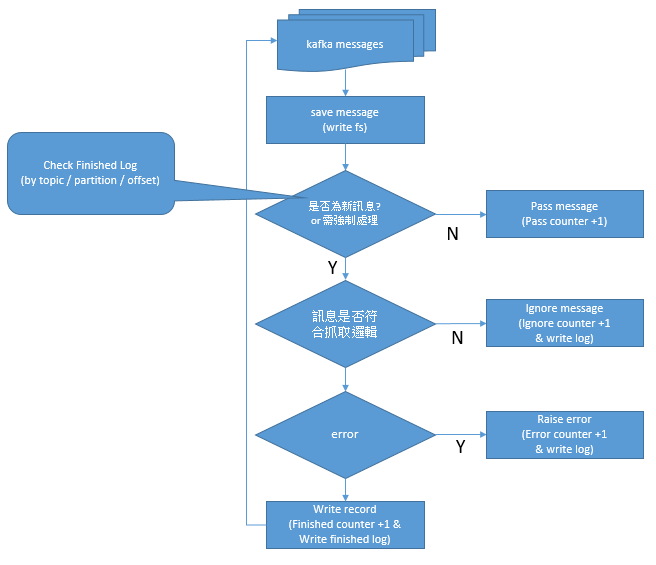

This project is for Wi-porcurement data processing

### data-process message flow


### Docker Logs 
`docker logs -f <container id>` 可看到如下log
```
2019-03-25T04:58:26.852Z 'sap_outbound_mm'
SAP_Outbound_MM 0 Counter: 131 (Finished: 129 /Error: 0 /Pass: 1 /Ignore: 0) CurrentOffset: 32848952
SAP_Outbound_MM 1 Counter: 0 (Finished: 0 /Error: 0 /Pass: 0 /Ignore: 0) CurrentOffset: null
SAP_Outbound_MM 2 Counter: 0 (Finished: 0 /Error: 0 /Pass: 0 /Ignore: 0) CurrentOffset: null
SAP_Outbound_MM 3 Counter: 52 (Finished: 50 /Error: 0 /Pass: 1 /Ignore: 0) CurrentOffset: 1999350
SAP_Outbound_MM 4 Counter: 90 (Finished: 88 /Error: 0 /Pass: 1 /Ignore: 0) CurrentOffset: 1072962
SAP_Outbound_MM 5 Counter: 52 (Finished: 33 /Error: 0 /Pass: 1 /Ignore: 17) CurrentOffset: 388758
```

`2019-03-25T04:58:26.852Z 'sap_outbound_mm'` 為Log時間, 以及模組名稱
`SAP_Outbound_MM 0 Counter: 131 (Finished: 129 /Error: 0 /Pass: 1 /Ignore: 0) CurrentOffset: 32848952` 依序為 **模組名稱** / **Broker Partition** / Counter: **目前該Partion訊息數量** / (**Status 訊息計數**) / CurrentOffset: **目前Offset number**


#### Logs Status

| Status | Description | 
| -------- | -------- | 
| Pass     | 已經抓過的訊息, 不重複抓     | 
| Ignore     | 訊息於相同topic內, 但不符合程式抓取邏輯     | 
| Error     | 其他異常狀態     | 


#### Config usage


| Config | Description | Default |
| -------- | -------- | -------- |
| forceProcess     | 設為true即不理會DB已記錄的offset, 仍會進行資料寫入     | false     |
| msgInterval     | console印訊息量計數器的時間區間     | 60000     |
| saveMessage     |  設為true會將message存入資料夾內     | false     |
| env     | consumer group的flag, 若於不同環境consume相同環境的kafka broker必須設定區別     | test     |


### DB Logs Scripts

#### 查看時間內訊息寫入狀態 (可透過filename的時間戳記判斷目前訊息的日期)
```
select * from wiprocurement.logs_kafka_finished where update_time >= '2019-03-25 12:00:00' order by update_time desc;
```

#### 查看時間內kafka訊息完成(finished)數量(by function)
```
select update_by,count(1) from wiprocurement.logs_kafka_finished where update_time between '2019-03-22' and '2019-03-23'
group by update_by order by update_by;
```

#### 查看時間內kafka例外處理數量(是否有Error/Pass/Ignore)
```
select logtype,logname,status,count(1) from wiprocurement.logs_kafka where update_time between '2019-03-22' and '2019-03-23'
group by logtype,logname,status;
```

### DB Logs table
#### logs_kafka_finished
記錄已完成寫入的kafka message, data-process啟動時會依此內容去找最後一次完成的offset, 避免重複抓取訊息


| Column name | Description | Sample |
| -------- | -------- | -------- |
| topic     | Kafka topic name     | "SAP_Outbound_FICO"     |
| partition     | Kafka partition number     | 2     |
| offset     | Message offset number    | 7581     |
| filename     | Message XML file name     | "ZFIM0003_201902052233164155.XML"     |
| update_time     | Message update time     | "2019-03-22 09:59:45+08"     |
| update_by     | function name     | "exchange_rate"     |

#### logs_kafka
其他非Finished狀態的kakfa logs


| Column name | Description | Sample |
| -------- | -------- | -------- |
| uuid     | log uuid    | "a5d25274-0a3a-11e9-bd1b-0242ac110002"     |
| logtype     | log type, fixed    | "kafka"     |
| logname     | function name    | "SAP_Outbound_MM_MatDoc"     |
| fetch_count     | message length (xml file 內資料筆數)    | 1     |
| update_time     | update time    | "2018-12-28 08:50:37+08"     |
| dura_sec     | message process duration (seconds)    | 1     |
| rsv1     | file name    | "ZMMM0003_201811291058004735.XML"     |
| rsv2     | no use    | "null"     |
| rsv3     | no use    | "null"     |
| status     | process status  (Error / Pass / Ignore)  | "Pass"     |
| create_time     | create time    | "2018-12-28 08:51:01.804378+08"     |
| partition     | kafka partition number    |      |
| offset     | message offset number    |      |


## Import Raw data

### Instrucation
- Scenraio: 某一function的data-process程式修改, 需要重新import資料 (Ex. info record)
  1. 停止目前data-process service `docker stop wiprocure_kafka_info_record`
  2. 啟動import service
  3. Call API - import all raw data(參數: StartDate, EndDate, TopicFunction)
  4. 檢查log確認是否import完成 (ConsoleLog, DB Log)
  5. 啟動data-process service

- Scenraio: 單一筆SAP資料有誤, 可能是當時Insert/Update DB失敗, 但有收到XML File 需要重新import資料
  1. 停止目前data-process service
  2. 啟動import service
  3. Call API - import single raw data (參數: topic, partition, offset, filename)
  4. 檢查log確認是否import完成 (ConsoleLog, DB Log)
  5. 啟動data-process service

### API Arguments
#### import all raw data
```
/importRawData/all/date/topic?endDate=20190515&tableName=MatMaster
```
- date: `20190505`
- topic: 
  - `www.sap.mm.material_master` for MatMaster
  - `po`
  - `info_record` 
  - `SAP_Outbound_FICO` for exchange_rate
  - `SAP_Outbound_Others` for img
  - `SAP_Outbound_MM` for MatDoc, Vendor_General
- tableName(only SAP_Outbound_MM):
  - 因為 SAP_Outbound_MM 有兩種不同的message type, 用來判斷import 那種message
  - arguments 有 `MatDoc`, `Vendor_General`
- endDate: 用來做一段時間的import, 沒有endDate 則會使用 call api 當下前一天的日期, 作為 endDate

#### import single raw data
```
/importRawData/single/type/date/topic/partition/offset/filename?tableName=MatDoc
```
- type: get fie from zip or from message, 
  - `zip`
  - `message`
- date: `20190505`
- topic: 
  - `www.sap.mm.material_master`
  - `wzs.sap.mm.po`
  - `wks.sap.mm.po`
  - `wtz.sap.mm.po`
  - `wcz.sap.mm.po`
  - `wmx.sap.mm.po`
  - `wih.sap.mm.po`
  - `wmt.sap.mm.po`
  - `wcq.sap.mm.po`
  - `wmcq.sap.mm.po`
  - `wcd.sap.mm.po`
  - `wzs.sap.mm.info_record`
  - `wks.sap.mm.info_record`
  - `wtz.sap.mm.info_record`
  - `wcz.sap.mm.info_record`
  - `wmx.sap.mm.info_record`
  - `wih.sap.mm.info_record`
  - `wmt.sap.mm.info_record`
  - `wcq.sap.mm.info_record`
  - `wmcq.sap.mm.info_record`
  - `wcd.sap.mm.info_record`
  - `SAP_Outbound_FICO`
  - `SAP_Outbound_Others`
  - `SAP_Outbound_MM`for MatDoc, Vendor_General
- partition
- offset
- filename
- tableName(only SAP_Outbound_MM):
  - 因為 SAP_Outbound_MM 有兩種不同的message type, 用來判斷import 那種message
  - arguments 有 `MatDoc`, `Vendor_General`

#### MatMaster separate from SAP_OUTBOUND_MM 
  - 因為 MatMaster 在YYYY-mm-dd 時 獨立成新的topic `www.sap.mm.material_master`,
  如要import YYYY-mm-dd 前MatMaster的資料, 請改用 topic `SAP_Outbound_MM` and 參數filename `MatMaster`

### Folder Structure

#### Kafka即時(當天)收下來的檔案
  * Message
    * 2019-06-05
      * SAP_Outbound_FICO
        * 0
          * 84375-ZMMM0016_201905130932429153.XML
          * 84375-ZMMM0016_201905130932429153.XML
          * ... {XML File}
        * 1
        * ... {Partition}
      * SAP_Outbound_MM
      * SAP_Outbound_Others
      * wcd.sap.mm.info_record
      * wcd.sap.mm.po
      * wcq.sap.mm.info_record
      * wcq.sap.mm.po
      * ... {Topic}

#### 壓縮檔存放資料夾 (by Date, Topic 壓縮)
  * back
    * 2019-05-11
      * SAP_Outbound_FICO_DateProcess.zip
      * SAP_Outbound_MM_DateProcess.zip
      * SAP_Outbound_Others_DateProcess.zip
      * wcd.sap.mm.info_record_DateProcess.zip
      * wcd.sap.mm.po_DateProcess.zip
      * wcq.sap.mm.info_record_DateProcess.zip
      * wcq.sap.mm.po_DateProcess.zip
      * ... {Topic}_DateProcess.zip
    * 2019-05-12
      * SAP_Outbound_FICO_DateProcess.zip
      * SAP_Outbound_MM_DateProcess.zip
      * SAP_Outbound_Others_DateProcess.zip
      * wcd.sap.mm.info_record_DateProcess.zip
      * wcd.sap.mm.po_DateProcess.zip
      * wcq.sap.mm.info_record_DateProcess.zip
      * wcq.sap.mm.po_DateProcess.zip
      * ... {Topic}_DateProcess.zip
    * ... {Date}

#### 解壓縮後的XML檔存放資料夾
  * output
    * 2019-05-11
      * SAP_Outbound_FICO
        * 0
          * 84375-ZMMM0016_201905130932429153.XML
          * 84375-ZMMM0016_201905130932429153.XML
          * ... {XML File}
        * 1
        * ... {Partition}
      * SAP_Outbound_MM
      * SAP_Outbound_Others
      * wcd.sap.mm.info_record
      * wcd.sap.mm.po
      * wcq.sap.mm.info_record
      * wcq.sap.mm.po
      * ... {Topic}
    * 2019-05-12
      * SAP_Outbound_FICO
      * SAP_Outbound_MM
      * SAP_Outbound_Others
      * wcd.sap.mm.info_record
      * wcd.sap.mm.po
      * wcq.sap.mm.info_record
      * wcq.sap.mm.po
      * ... {Topic}
    * ... {Date}

